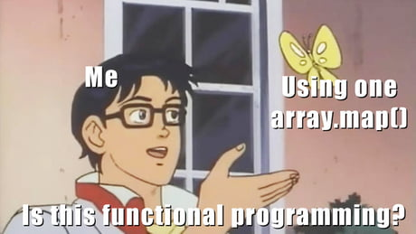

---

Une fonction doit être:
- pure: son seul but est de fournir un résultat sans utiliser le monde extérieur
- totale: elle donne un résultat pour chaque paramètre
- déterministe: elle donne toujours le même résultat pour le même paramètre

note: here is a side note