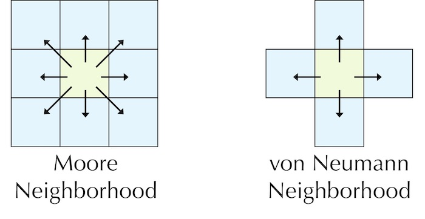

# Systèmes multi-agents

Ce projet a pour but de mettre en application les principes de Programmation Fonctionnelle apprises pendant le cours.
Il s'articule autour de 2 applications ScalaFX obligatoires à implémenter:
- simulateur de particules (8 points)
- wator (jeu de la vie avec des requins et des thons) (6 points)

Et une 3e application au choix entre:
- prédateur(s)/proie (6 points)
- application libre (6 points)

Le simulateur de particules et le jeu Wator sont obligatoires, et constituent 14 points sur les 20 du projet.
Les 6 derniers points seront obtenus en implémentant au choix soit l'application prédateur(s)/proie, soit une application avec
un sujet libre.

Chaque application est un système multi-agents. C'est-à-dire l'environnement (la fenêtre) contiendra des agents qui ont
chacun leur propre intelligence et se déplacent en fonction de leur environnement proche (voisinage). Deux types de
voisinages sont en général utilisés:
- Von Neumann (`Nord`, `Sud`, `Est`, `Ouest`)
- Moore (`Nord`, `Sud`, `Est`, `Ouest`, `Nord-Est`, `Nord-Ouest`, `Sud-Est`, `Sud-Ouest`)

ℹ️ Nous n'allons considérer que le voisinage de Moore pour implémenter ces applications.

### Simulateur de particules

Cette application simule des particules qui se déplacent indéfiniment dans l'environnement.

Chaque particule est un cercle défini par:
- son rayon: fixe (le même pour toutes les autres particules)
- sa couleur: aléatoire
- sa position: aléatoire
- sa direction: aléatoire selon le voisinage de Moore

À chaque cycle:
- une particule se déplace dans la prochaine case suivant sa direction
- si elle arrive aux bords de l'environnement, elle réapparaît de l'autre côté
- si elle cogne une autre particule, elle change de direction et prend une autre direction aléatoire
